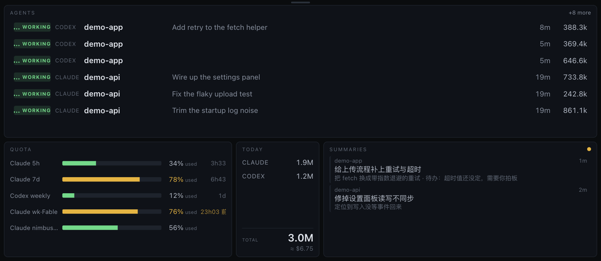
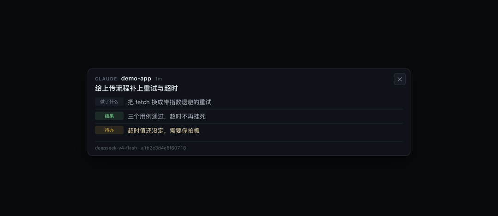

# pitwall

An always-on wall for every coding agent you have running.

One local daemon watches your Claude Code, Codex and DSH sessions; one borderless
macOS window shows them all at once — who is working, who is idle, how much of your
quota is gone, and a short summary of every session that just ended.



Click any summary to see what that agent actually did:



*(Both screenshots run on synthetic data.)*

## What it does

- **Live agent list** — harness, project, title, state, age, tokens. States are
  animated, so "still working" and "stopped an hour ago" are different at a glance.
- **Quota** — Claude 5h / 7d, Codex weekly, DeepSeek balance, in one column. Bars
  fill as quota is consumed; a row whose source has gone stale says how old it is
  instead of pretending to count down.
- **Today** — tokens per harness, with a cost estimate priced from
  [models.dev](https://models.dev).
- **Summaries** — when a session ends, its transcript is summarised into four
  lines: what it was about, what was done, how it turned out, what is left for you.

It is **read-only**. It never writes to `~/.claude`, `~/.codex` or `~/.dsh`, never
sends a mutating command to herdr, and cannot start, stop or steer an agent.

## What it reads, and what leaves your machine

This tool reads your agent transcripts. You should know exactly what that means
before running it.

**Read from disk (read-only):**

| Path | For |
|---|---|
| `~/.claude/projects/**`, `~/.claude/sessions/**` | Claude Code sessions, token usage |
| `~/.claude.json`, `~/.claude/plugins/claude-hud/.usage-cache.json` | Anthropic quota |
| `~/.codex/sessions/**`, `~/.codex/state_5.sqlite` | Codex sessions, quota |
| `~/.dsh/sessions/**` | DSH sessions |
| `~/.config/herdr/herdr.sock` | which agents are live right now |

Credential files are never opened. Other processes' SQLite databases are opened
read-only.

**Sent off your machine — three destinations, all optional:**

1. `api.deepseek.com` — to summarise a session that just ended. What is sent: the
   human turns and the agent's text replies, **not** tool arguments, tool output or
   file contents. Everything is passed through `daemon/src/redact.rs` first
   (API keys, tokens, JWTs, private keys, high-entropy blobs) and truncated to
   24 000 characters. Turn it off with `AGENT_MONITOR_SUMMARIZE=0`.
2. `api.deepseek.com/user/balance` — your DeepSeek balance. Off with
   `AGENT_MONITOR_DEEPSEEK_BALANCE=0`.
3. `models.dev` — the public price table. No data of yours goes with the request.

**Both DeepSeek calls are on by default.** If you do not want any transcript text
leaving the machine, start the daemon with
`AGENT_MONITOR_SUMMARIZE=0 AGENT_MONITOR_DEEPSEEK_BALANCE=0` and everything except
the summaries column still works.

The HTTP server binds `127.0.0.1` only.

> Worth knowing regardless of this tool: agent transcripts really do contain live
> credentials — a key you once pasted into a chat stays in the local record and
> gets replayed on every compaction. That is why `redact.rs` exists. See
> [`docs/FINDINGS.md`](docs/FINDINGS.md).

## Requirements

macOS only (the window is an `NSPanel`). Built and run against:

| | version |
|---|---|
| macOS | 26.3 |
| Rust | 1.97 (stable) |
| Xcode | 26.5 (+ `xcodegen` for the window shell) |
| Node | 22 (only for the DSH plugin) |
| pnpm | 11 (only for the DSH plugin) |

Optional and independent: [herdr](https://github.com/) for live pane status, and
the `claude-hud` plugin for fresher Anthropic quota. Without either, the daemon
falls back to reading files and still works.

## Quick start

```sh
# daemon — collects, stores, serves 127.0.0.1:39917
cd daemon && cargo build --release && ./target/release/agent-monitord

# window — borderless, always on top, never takes focus
cd strip && xcodegen && xcodebuild -scheme AgentMonitorStrip -configuration Release build
open build/Build/Products/Release/AgentMonitorStrip.app
```

Then drag the window's top edge to move it, any edge to resize. Position and size
are remembered. Details in [`strip/README.md`](strip/README.md).

For a summary column you also need a DeepSeek key, read in this order:
`DEEPSEEK_API_KEY` → `~/.dsh/.credentials.yaml` → `~/.hermes/.env`.

## Configuration

Everything is an environment variable; there is no config file.

| variable | default | |
|---|---|---|
| `AGENT_MONITOR_PORT` | `39917` | HTTP + SSE port, bound to `127.0.0.1` |
| `AGENT_MONITOR_HOME` | `~/.agent-monitor` | where `monitor.sqlite` lives |
| `AGENT_MONITOR_SUMMARIZE` | `1` | `0` disables all summary requests |
| `AGENT_MONITOR_DEEPSEEK_BALANCE` | `1` | `0` disables the balance lookup |
| `AGENT_MONITOR_SUMMARY_MODEL` | `deepseek-v4-flash` | |
| `AGENT_MONITOR_SUMMARY_BASE_URL` | `https://api.deepseek.com` | point it at any OpenAI-compatible endpoint |
| `AGENT_MONITOR_SUMMARY_MAX_CHARS` | `24000` | transcript budget per summary |
| `AGENT_MONITOR_LIVE_POLL_MS` | `2000` | herdr poll |
| `AGENT_MONITOR_SCAN_POLL_MS` | `15000` | transcript rescan |
| `AGENT_MONITOR_QUOTA_POLL_MS` | `60000` | quota refresh |
| `AGENT_MONITOR_STALE_AFTER_MS` | `120000` | when a quiet agent counts as idle |
| `CLAUDE_CONFIG_DIR`, `CODEX_HOME`, `DSH_HOME`, `HERDR_SOCKET_PATH` | standard | override where each harness is read from |

## Layout

| | language | |
|---|---|---|
| `daemon/` | Rust | collectors, SQLite, cost accounting, summariser, HTTP + SSE |
| `strip/` | Swift | `NSPanel(.nonactivatingPanel)` + `WKWebView`, always on top, never key |
| `web/` | HTML/JS | the page, served by the daemon |
| `plugin/` | TypeScript | DSH plugin: a dock plus two read-only model tools |
| `docs/FINDINGS.md` | | measured formats and traps for each harness — the useful part |

The binary is still called `agent-monitord` and its variables still start with
`AGENT_MONITOR_`; renaming those is a separate change.

## Status

Personal tool, published because the harness-format notes in `docs/FINDINGS.md`
are worth more to other people than to me. It is built against herdr 0.8.0,
DSH 0.1.0-rc.6, and the Claude Code / Codex on-disk layouts as of August 2026 —
all of which move. If a collector goes quiet after an upgrade, that is why.

## License

MIT
